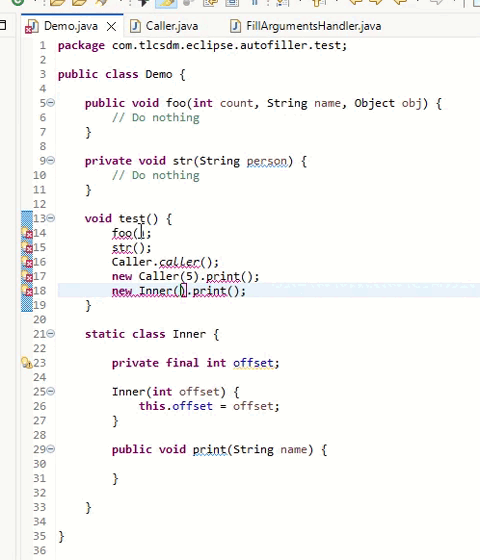

# Auto Filling Java Call Arguments

This plugin guesses the call parameters by the callee parameter names.

## Use  
1. Via Eclipse Content Assist  
Press Ctrl + Space (Content Assist) inside the parentheses.

2. Using the Shortcut Key  
Place the cursor inside a method call or on the method name and then press Ctrl + Alt + O



## Build

This project uses [Tycho](https://github.com/eclipse-tycho/tycho) with [Maven](https://maven.apache.org/) to build. It requires Maven 3.9.0 or higher version.

Dev build:

```
mvn clean verify
```

Release build:

```
mvn clean org.eclipse.tycho:tycho-versions-plugin:set-version -DnewVersion=2.0.0 verify
```

## Install

1. Add `https://raw.githubusercontent.com/tlcsdm/eclipse-autofill-arguments/master/update_site/` as the upgrade location in Eclipse.
2. Download from [Jenkins](https://jenkins.tlcsdm.com/job/eclipse-plugin/job/eclipse-autofill-arguments)
